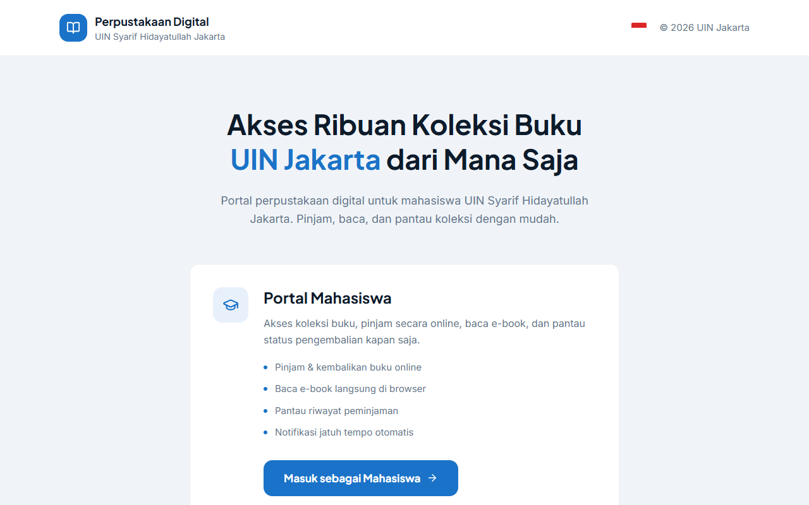
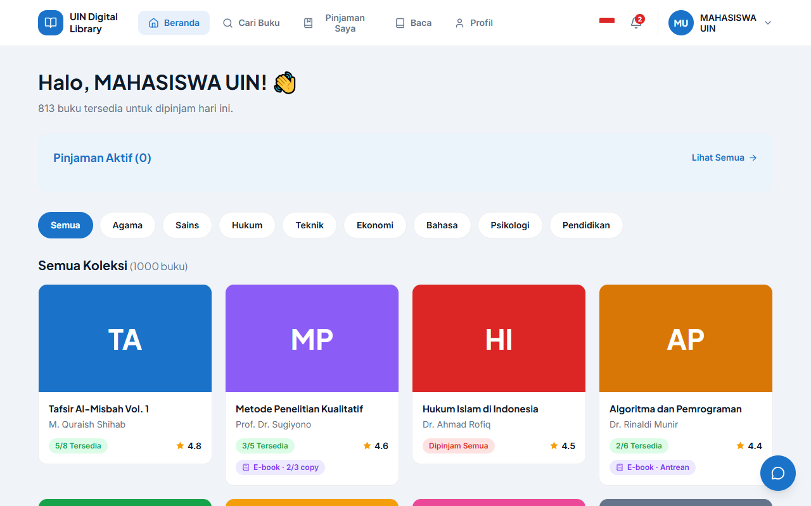
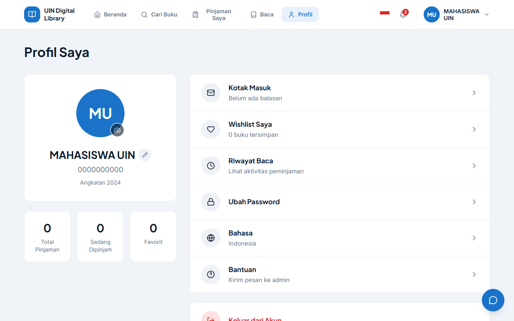
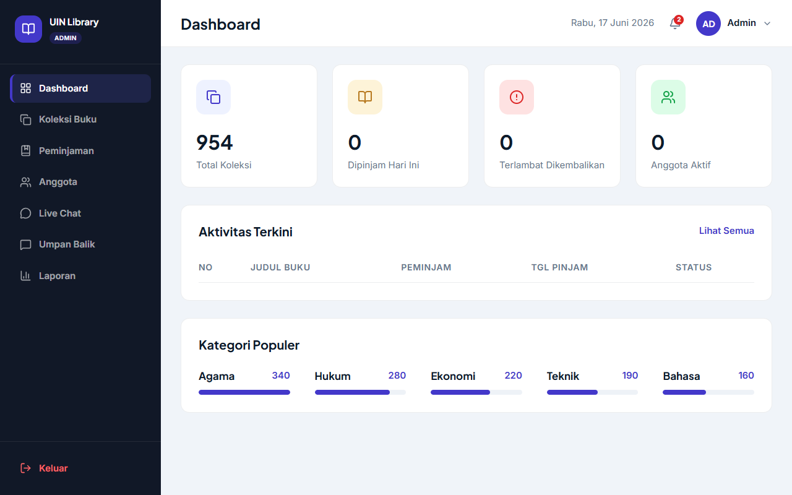

<h1 align="center">Perpustakaan Digital UIN Jakarta</h1>

<p align="center">
  Perpustakaan digital dengan antarmuka Mahasiswa dan Admin yang terpisah:
  pinjam buku fisik, baca e-book, dan kelola koleksi dari satu aplikasi.
</p>

<p align="center">
  
  
  
  
  
  
</p>

---

## Daftar Isi

- [Tentang Proyek](#tentang-proyek)
- [Fitur](#fitur)
- [Integrasi Google Books](#integrasi-google-books)
- [Tangkapan Layar](#tangkapan-layar)
- [Teknologi](#teknologi)
- [Struktur Repository](#struktur-repository)
- [Memulai](#memulai)
- [Konfigurasi Firebase](#konfigurasi-firebase)
- [Integrasi SSO UIN](#integrasi-sso-uin)
- [Keamanan](#keamanan)
- [Skrip](#skrip)
- [Peta Jalan](#peta-jalan)
- [Lisensi](#lisensi)

---

## Tentang Proyek

Aplikasi ini dibuat untuk perpustakaan kampus UIN Syarif Hidayatullah Jakarta.
Mahasiswa dan Admin memakai alamat (URL) yang sepenuhnya terpisah, masing-masing
dengan tampilan dan alur kerja sendiri, bukan satu dasbor yang dipaksa muat
untuk dua peran sekaligus.

Mahasiswa dapat menelusuri koleksi, mereservasi buku fisik, meminjam e-book,
membaca langsung di peramban, memberi ulasan, dan memantau tenggat
pengembalian. Admin mengelola koleksi buku, memproses peminjaman, memantau
anggota, membalas komentar pengguna, dan menyusun laporan.

> Tampilan mengikuti rancangan Figma "Perpustakaan Digital" sebagai acuan visual.

---

## Fitur

**Portal Mahasiswa**
- Beranda dengan koleksi ~1.000 buku, filter kategori, dan ringkasan pinjaman
  aktif yang bisa langsung diklik untuk mengembalikan buku.
- Pencarian berdasarkan judul, penulis, atau ISBN dengan filter ketersediaan.
- Detail buku dengan rating, stok, ketersediaan e-book, tombol Suka/Favorit,
  dan kolom komentar dengan balasan admin.
- Reservasi buku fisik: pilih durasi, konfirmasi, sampai bukti peminjaman,
  lengkap dengan alur pengembalian dan komentar untuk perpustakaan.
- Peminjaman e-book dengan pengembalian otomatis setelah masa pinjam berakhir.
- Pembaca e-book berbab, dilengkapi daftar pustaka, pengatur ukuran huruf,
  mode gelap, dan penanda bab.
- Antrean untuk buku yang sedang habis, dengan perkiraan tanggal tersedia.
- Pinjaman Saya (Buku Fisik / E-book / Riwayat), kotak masuk balasan admin,
  dan profil dengan statistik yang dihitung dari aktivitas nyata, foto
  profil, dan data akademik (NIM/fakultas/prodi) yang bisa diedit sendiri.
- **Live chat** ke admin lewat tombol mengambang: pertanyaan umum (jam
  operasional, cara pinjam, e-book, lupa sandi, dll.) langsung dijawab
  otomatis, dengan label jelas mana balasan otomatis dan mana admin
  sungguhan; menampilkan status terkirim/dibaca dan posisi antrean.
- Bahasa antarmuka: Indonesia, English, dan العربية (RTL penuh, termasuk
  bendera Arab Saudi yang dirender dari teks Arab asli), bisa diganti dari
  bendera di header. Mencakup seluruh halaman portal mahasiswa (beranda,
  cari, detail buku, reservasi, pinjaman, baca, profil, live chat); judul
  dan isi buku tetap Bahasa Indonesia karena itu data katalog, bukan teks
  antarmuka.

**Panel Admin**
- Dashboard dengan statistik dan aktivitas peminjaman terkini.
- Koleksi Buku: tambah, ubah, hapus, cari, filter status, baca e-book online,
  dan isi data buku otomatis dari Google Books.
- Peminjaman dengan penyaringan status, dan Data Anggota (hanya mahasiswa
  yang benar-benar mendaftar, tanpa data contoh).
- Umpan Balik: seluruh komentar, suka, dan favorit pengguna terkumpul di satu
  tempat; admin membalas dan balasannya diteruskan ke pengguna terkait.
- **Live Chat**: kotak masuk percakapan real-time dengan antrean bernomor
  (yang belum dijawab didahulukan), dan panel "Info Akun" untuk mencocokkan
  identitas mahasiswa sebelum memproses permintaan reset password.
- **Reset password beralasan wajib**: admin tidak pernah melihat password
  asli (mustahil secara teknis di Firebase) - admin memicu tautan reset
  resmi, wajib mengisi alasan/bukti verifikasi identitas (≥20 karakter) yang
  dicatat sebagai audit log dan ditegakkan lewat Security Rules, bukan cuma
  validasi UI.
- Laporan: peminjaman bulanan, buku terpopuler, keterlambatan, dan kategori
  favorit, dengan grafik interaktif dan opsi ekspor data.

**Autentikasi & Keamanan**
- Mahasiswa: SSO UIN, Google, email tanpa kata sandi, atau NIM. Tersedia
  pendaftaran mandiri, indikator kekuatan sandi saat mendaftar, dan halaman
  reset password bermerek sendiri (bukan halaman generik Firebase).
- Admin: hanya akun Google yang terdaftar pada allowlist (`VITE_ADMIN_EMAILS`)
  yang bisa masuk - diverifikasi lewat sesi Firebase asli, bukan flag lokal
  yang bisa dipalsukan dari DevTools.
- Firestore Security Rules memvalidasi peran pengirim di setiap pesan chat
  (mencegah pemalsuan pesan "admin"), membatasi panjang field yang bisa
  ditulis publik, dan sudah melalui tinjauan keamanan (`npm audit` bersih,
  tanpa kerentanan dependensi).

---

## Integrasi Google Books

Katalog dan formulir admin tersambung ke [Google Books API](https://developers.google.com/books)
agar data buku sesuai dengan data yang benar-benar ada, bukan contoh karangan:

- **Sampul asli** - komponen `RemoteCover` (`components/ui.tsx`) mengambil
  gambar sampul dari Google Books saat buku ditampilkan, dan kembali ke blok
  warna berinisial bila API tidak menemukan hasil atau sedang tidak dapat
  dihubungi.
- **Pencarian di formulir admin** - saat menambah atau mengubah buku
  (`modules/admin/Koleksi.tsx`), admin bisa mencari judul di Google Books lalu
  klik salah satu hasil untuk mengisi otomatis penulis, penerbit, tahun terbit,
  ISBN, dan deskripsi.
- Layanan ini (`services/googleBooks.ts`) memakai endpoint publik tanpa API
  key, dengan timeout, cache 7 hari di `localStorage`, dan selalu mengembalikan
  hasil kosong (bukan error) saat gagal, sehingga tampilan tidak pernah rusak.

---

## Tangkapan Layar

Tangkapan layar di bawah diambil langsung dari aplikasi yang berjalan (mode
demo), bukan mockup. Referensi rancangan Figma asli tersedia di
[`referensi-desain/`](referensi-desain/).

| Landing Page | Beranda Mahasiswa |
| :---: | :---: |
|  |  |

| Profil Mahasiswa | Dashboard Admin |
| :---: | :---: |
|  |  |

---

## Teknologi

| Kategori | Teknologi |
| --- | --- |
| Framework | React 19 |
| Bahasa | TypeScript |
| Build Tool | Vite |
| Styling | Tailwind CSS v4 |
| Routing | React Router |
| Autentikasi | Firebase Authentication (Email/Password, Google) |
| Data Buku | Google Books API |
| Ikon | lucide-react |
| Tipografi | Plus Jakarta Sans, Inter, JetBrains Mono |

---

## Struktur Repository

Root repository ini adalah root aplikasinya sendiri, tanpa folder pembungkus.
Alias `@/` mengarah ke root ini sehingga impor tetap pendek dan jelas asalnya
(mis. `@/services/libraryStore`):

```text
perpustakaan-digital/
├── app/               # Titik masuk (main.tsx) dan definisi rute (App.tsx)
├── common/
│   ├── constants/     # Katalog buku dan metadata aplikasi
│   └── libs/          # Firebase, keamanan, SSO, unduhan
├── components/        # Komponen bersama: UI dasar, sampul buku, shell, feedback
├── contents/          # Naskah e-book (isi bab dan daftar pustaka)
├── hooks/             # React hooks kustom (mis. useIdleLogout)
├── i18n/              # Konfigurasi bahasa
├── messages/          # Berkas terjemahan (id.json, en.json)
├── modules/
│   ├── auth/          # Landing, login mahasiswa, daftar, SSO, login admin
│   ├── user/          # Halaman portal mahasiswa
│   └── admin/         # Halaman panel admin
├── services/          # Data & status: auth, akun, sesi, pinjaman, anggota,
│                      # notifikasi, antrean, umpan balik, Google Books
├── middleware.ts      # Aturan akses terpusat
├── public/            # Aset statis (favicon, ikon)
└── referensi-desain/  # Tangkapan layar rancangan Figma sebagai acuan visual
```

---

## Memulai

```bash
git clone https://github.com/damta8827773/perpustakaan-digital.git
cd perpustakaan-digital
npm install
cp .env.example .env.local
npm run dev
```

Buka alamat yang ditampilkan di terminal (biasanya `http://localhost:5173`).
Selama `.env.local` berisi `VITE_DEMO=1`, login dilewati sehingga seluruh
tampilan bisa langsung dicoba tanpa mengisi kredensial Firebase.

Untuk build produksi:

```bash
npm run build
npm run preview
```

### Peta Rute

| Rute | Deskripsi |
| --- | --- |
| `/` | Halaman pemilihan peran |
| `/login`, `/daftar` | Login dan pendaftaran mahasiswa |
| `/app` | Beranda mahasiswa |
| `/admin/login` | Login admin (Google) |
| `/admin` | Dashboard admin |

---

## Konfigurasi Firebase

1. Buat proyek di [Firebase Console](https://console.firebase.google.com/).
2. Aktifkan **Authentication → Sign-in method → Email/Password** dan **Google**.
3. Salin kredensial Web App ke `.env.local`:

   ```env
   VITE_FIREBASE_API_KEY=...
   VITE_FIREBASE_AUTH_DOMAIN=...
   VITE_FIREBASE_PROJECT_ID=...
   VITE_FIREBASE_STORAGE_BUCKET=...
   VITE_FIREBASE_MESSAGING_SENDER_ID=...
   VITE_FIREBASE_APP_ID=...
   VITE_ADMIN_EMAILS=email-admin-anda@gmail.com
   ```

4. Hapus baris `VITE_DEMO=1` untuk mengaktifkan login sungguhan.
5. Aktifkan **Firestore Database** (mode production) di Firebase Console,
   lalu deploy Security Rules dan indeksnya:

   ```bash
   npx firebase-tools login
   npx firebase-tools deploy --project <id-proyek-anda> --only firestore:rules,firestore:indexes
   ```

   Tanpa langkah ini, fitur yang memakai Firestore (foto profil, live chat,
   reset password oleh admin) akan gagal dengan error izin ditolak - rules
   dan indeks harus di-deploy ulang setiap kali file `firestore.rules` atau
   `firestore.indexes.json` berubah.
6. Salin manual daftar email di `isAllowlistedAdminEmail()` pada
   `firestore.rules` supaya persis sama dengan `VITE_ADMIN_EMAILS` - Security
   Rules tidak bisa membaca environment variable aplikasi.

> `.env.local` sudah tercantum di `.gitignore` dan tidak pernah ikut ter-commit.

---

## Integrasi SSO UIN

Tombol **Masuk dengan SSO UIN** mengarahkan pengguna ke portal resmi
`e-semesta.uinjkt.ac.id`. Mode diatur lewat `SSO_MODE` di `common/libs/sso.ts`:

| Mode | Perilaku |
| --- | --- |
| `portal-uin` | Membuka portal SSO UIN yang asli (mode saat ini) |
| `oidc` | Alur OIDC/CAS resmi (aktif setelah aplikasi terdaftar) |
| `simulasi` | Alur simulasi untuk pengembangan |

Integrasi login otomatis penuh membutuhkan pendaftaran resmi ke pengelola SSO
kampus (PTIPD UIN) untuk memperoleh `client_id` dan endpoint; penukaran token
wajib dilakukan di sisi server, bukan di peramban.

---

## Keamanan

- Seluruh kredensial dibaca dari `.env.local`, tidak pernah di-commit.
- Validasi input: format NIM, username, dan panjang kata sandi.
- Pembatasan percobaan login: penguncian sementara setelah beberapa kali gagal.
- Logout otomatis saat pengguna tidak aktif; sesi berakhir saat tab ditutup.
- Panel admin dibatasi allowlist email dan hanya menerima login Google.
- Permintaan ke Google Books memakai endpoint publik tanpa kredensial, dengan
  timeout dan fallback aman bila gagal.

Rincian lengkap ada di [`SECURITY.md`](SECURITY.md).

---

## Skrip

| Perintah | Keterangan |
| --- | --- |
| `npm run dev` | Server pengembangan |
| `npm run build` | Build produksi ke `dist/` |
| `npm run preview` | Meninjau hasil build secara lokal |

---

## Peta Jalan

**Sudah selesai**
- [x] Live chat mahasiswa-admin di Cloud Firestore (real-time, lintas
      perangkat), dengan balasan otomatis berbasis kata kunci yang ikut
      bahasa antarmuka aktif (id/en/ar).
- [x] Identitas pengguna (`users/{uid}`) di Firestore untuk deteksi peran
      admin/mahasiswa yang aman di sisi server (Security Rules).
- [x] Foto profil (disimpan sebagai gambar terkompresi di Firestore, tanpa
      perlu Firebase Storage/paket berbayar), dengan pengecualian indeks
      otomatis Firestore (`firestore.indexes.json`) supaya field gambar
      yang besar tidak ditolak oleh batas indeks bawaan.
- [x] Reset password oleh admin dengan audit log wajib beralasan.
- [x] Terjemahan penuh seluruh halaman portal mahasiswa (beranda, cari,
      detail buku, reservasi, konfirmasi, pinjaman, baca, profil, live
      chat) ke Indonesia/English/العربية, termasuk format tanggal dan waktu
      yang ikut bahasa aktif.

**Belum selesai**
- [ ] Menghubungkan koleksi buku, peminjaman, dan data anggota ke Cloud
      Firestore (saat ini masih di `localStorage` per-browser, bukan
      basis data bersama - lihat [`services/libraryStore.ts`](services/libraryStore.ts)).
- [ ] Penyimpanan berkas e-book pada Firebase Storage.
- [ ] Integrasi SSO OIDC/CAS resmi dengan penukaran token di sisi server.
- [ ] Notifikasi tenggat pengembalian lewat email/push, bukan hanya in-app.
- [ ] Ekspor laporan ke format PDF dan Excel yang sesungguhnya.
- [ ] Terjemahan konten katalog (judul, deskripsi, isi bab e-book) dan panel
      admin - saat ini tetap Bahasa Indonesia karena berupa data konten,
      bukan teks antarmuka.

---

## Lisensi

Lisensi MIT. Lihat [`LICENSE`](LICENSE).

---

<p align="center">
  <sub>Perpustakaan Digital UIN Syarif Hidayatullah Jakarta</sub>
</p>
